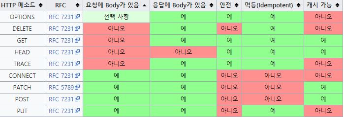

# Week2

# Express 공식 문서 훑어보기

[4.x API](https://expressjs.com/en/4x/api.html)

# 정적 파일 제공

- `express.static()`

  ```jsx
  const express = require('express');
  const app = express();

  app.use('/public', express.static('public'));

  app.listen(9000, () => {
    console.log('서버 실행 중');
  });
  ```

- 페이지(html) 응답

  ```jsx
  // html 폴더에 .html이 존재한다면
  app.use('/html', express.static('html'));
  ```

- 이미지 응답

  ```jsx
  app.use('원하는 경로', express.static('이미지가 존재하는 폴더'));
  ```

# path 모듈

- node.js standard module

  ```jsx
  const path = require('path');
  ...
  app.use('/public', express.static(path.join(__dirname, 'public')));
  ```

- `path.json([...paths])`

  path.join은 String을 주게 되면 플랫폼별(windows냐 mac이냐) 구분자를 사용해서 경로를 정규화해서 리턴

# Postman

- API 요청 테스트 프로그램
- 클라이언트의 입장이 되어보자~
- 설치

  [Download Postman | Try Postman for Free](https://www.postman.com/downloads/)

# BodyPaser

- express 는 request의 body를 바로 볼 수 없음
- 파싱(구문 분석) 후 확인 가능 즉, js에서 사용할 수 있도록 해줌
- 4.16 을 기준으로 상위 버전들은 express에 내장됨
- **복습!**

  

- 설치 (우린 안 할거임)

  ```bash
  npm i body-paser
  ```

- bodyParser 등록 없이 body를 확인해보자
- 미들웨어 등록

  ```jsx
  app.use(express.json());
  app.use(express.urlencoded({ extended: true }));
  ```

# Middleware

- **어플플리케이션 레벨 미들웨어**

  - 앱 최상단에서 거쳐가는 미들웨어

    ```jsx
    app.use((req, res, next) => {
      next();
    });

    app.use('/경로', (req, res, next) => {
      next();
    });
    app.use('/경로', function (req, res, next) {
      next();
    });
    ```

- **에러핸들링 미들웨어**

  - 보통 최하단 미들웨어로 존재
  - 발생한 에러를 처리하는 미들웨어

    ```jsx
    app.use((err, req, res, next) => {
      // err에 대한 핸들링하기
    });
    ```

- **라우터 레벨 미들웨어**

  - 특정 라우터 객체에서 동작하는 미들웨어

    ```jsx
    const router = require('express').Router();

    router.use((req, res, next) => {
      next();
    });

    // post, patch, put, delete
    router.get('/경로', (req, res, next) => {});
    ```

- **로거 만들어보기**
  - 실습

# Routing

- Router 객체를 이용해 express application 처럼 사용 가능

  ```jsx
  const router = require('express').Router();
  ...
  module.exports = router; // 수출
  ```

- 라우트별 모듈화를 위해 사용

# API

- **A**pplication **P**rogramming **I**nterface의 약자
- **interface**는 물건을 조작하기 위한 디자인을 뜻함
- **User Interface** 는 사용자와 애플리케이션간의 인터페이스
- **Application Programming** **interface** 는 애플리케이션 개발을 위해 프로그램간의 인터페이스

즉, **API는 사람을 위한 인터페이스가 아니라 프로그램을 위한 인터페이스라는 것**

# 외부 API 연습

[JSONPlaceholder](https://jsonplaceholder.typicode.com/)

[](https://api.github.com/users/bbaktaeho)

[bbaktaeho 깃허브 유저 api](https://api.github.com/users/bbaktaeho)

# JSON

**J**ava**S**cript **O**bject **N**otation

- "속성" : 값
- 클라이언트와 통신 시 주로 사용

```json
{
    "userId": 1,
    "id": 1,
    "title": "sunt aut facere repellat provident occaecati excepturi optio reprehenderit",
    "body": "quia et suscipit\nsuscipit recusandae consequuntur expedita et cum\nreprehenderit molestiae ut ut quas totam\nnostrum rerum est autem sunt rem eveniet architecto"
 },
```

# REST

- REST란 **Re**presentational **S**tate **T**ransfer 의 약자로 소프트웨어 개발의 아키텍처의 한 형식
- 해석하면 자원의 대표에 의한 상태 전달

# 자원의 대표

- 자원이란 소프트웨어가 관리하는 모든 것이 될 수 있음
- 예를 들어 DB에 학생 명부가 저장되어 있따고 한다면 이 학생들의 정보가 자원이 됨
- 여기서 자원의 대표는 그 자원을 대표하기 위한 이름을 뜻함
- students 라고 이름을 지어 대표로 사용하면 됨
- 각 학생의 대한 자원을 얻고자 한다면 대표이름과 한 학생을 특정할 수 있는 id 를 사용

# 상태 전달

- 데이터가 요청되어지는 시점에서 자원의 상태(정보)를 전달하는 것을 뜻함
- 프로그램이 학생 명부 전체 리스트를 요청받으면 요청받은 시점의 '상태'를 전달하게 됨
- 자원을 이름으로 구분하고 해당 자원의 상태를 주고 받는 모든 것이 REST라고 할 수 있지만 일반적으로 **REST라고 하면 좁은 의미로 HTTP를 통해 CRUD를 실행하는 API를 뜻함**
